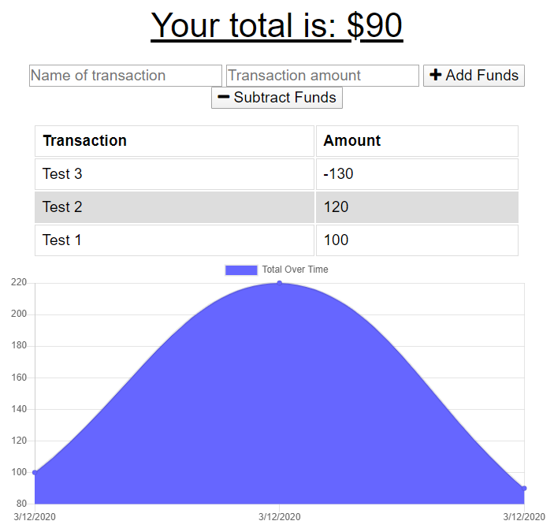

# Progressive Budget Tracker

## Introduction

Track your budget with this app by simply entering the name and amount of the transaction. No internet connection? You can still use the app and submit new transactions. It will automatically update the database as soon as you are connected again.

This web app runs on MongoDB, Express, Node.js.

[Live Demo](https://sheltered-bayou-34934.herokuapp.com/)

## Installation

**Node.js v12+** and **MongoDB v4+** are required in order to run this web app.

1. Download or clone this repository into your local computer.
2. In your terminal, browse to the folder and run `npm install --production`.

## Usage

1. In your terminal, run the script with the command `npm start`, which will start the backend server and frontend web app.
2. Visit `http://localhost:3000` to access the web app.
3. Enter a new transaction name and amount to add or subtract to the budget tracker.

## Preview

